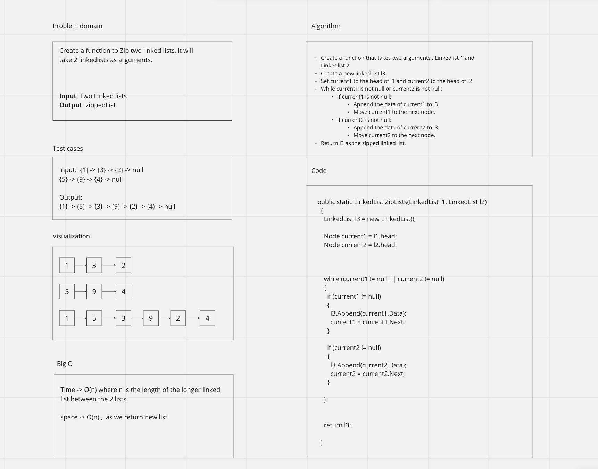

# Linked List

A Singly linked list class that has head and tail, and many functions:
- function IsEmpty() to check if list is empty
- function Append() to add a number at the end of the list
- function InsertBefore() adds a new node with the given new value immediately before the first node that has the value specified
- function InsertAfter() adds a new node with the given new value immediately after the first node that has the value specified
- function PrintList() to print the list
- function KthFromEnd() that Returns the node’s value that is k places from the tail of the linked list.
- function ZipLists() to zip to passed linked lists

## WhiteBoard - CC8

