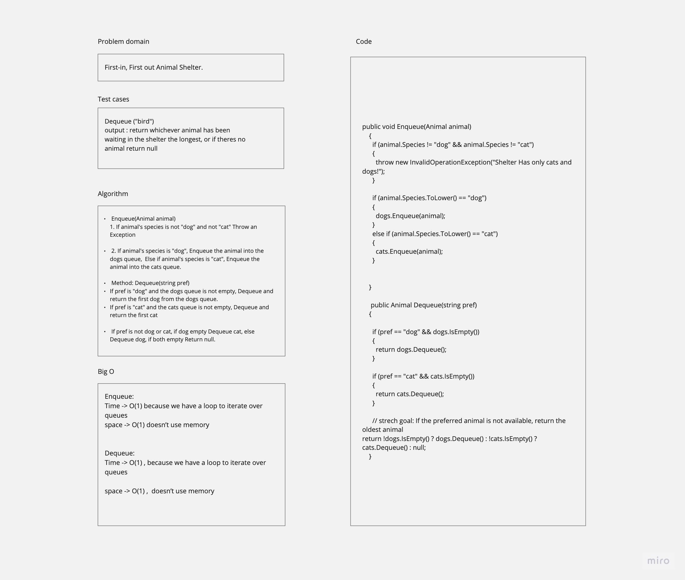

## Stack and Queue Implementation

**This console app implement stack and queue using a Linked List as the underlying data storage mechanism**

## Features

- **Stack:** The Stack class provides operations to push elements onto the stack, pop elements off the stack, peek at the top element without removing it, and check if the stack is empty.
- **Queue:** The Queue class allows you to enqueue elements into the queue, dequeue elements from the front of the queue, peek and check if the queue is empty.

# CC-11 (Implement a Queue using two Stacks)

# PseudoQueue Class

This class contains an implementation of a queue data structure using two internally managed stacks. It provides a (FIFO) approach for inserting and extracting values.

## Features

- **Enqueue:** Takes a value as an argument, Inserts a value into the PseudoQueue.
- **Dequeue:** Extracts a value from the PseudoQueue using a FIFO approach.

----------------------------------

# CC-12 (First-in, First out Animal Shelter.)

Class: AnimalShelter

Properties:
- Queue dogs
- Queue cats

Methods
- Enqueue (Animal animal)
- Dequeue (string pref)

----------------------------------

# CC-13 (Multi-bracket Validation)

Method: ValidateBrackets

